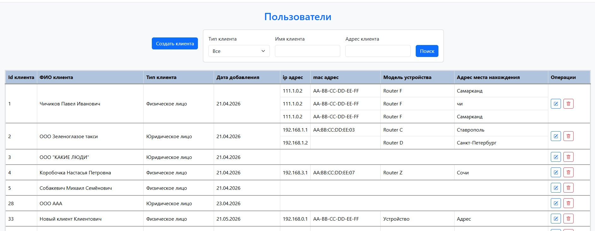
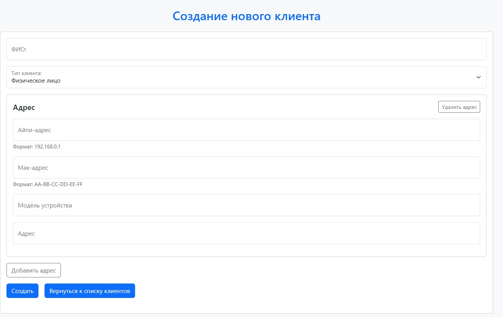
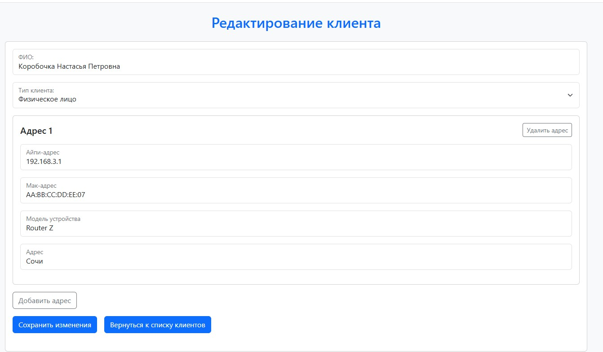

# Client Management System

Client Management System — клиент-серверное приложение для управления клиентами и их сетевыми адресами.
Проект реализует CRUD-операции для клиентов и связанных с ними сетевых адресов с использованием PostgreSQL в качестве хранилища данных.

Проект реализован как многомодульный Maven-проект и состоит из двух независимых Spring Boot приложений:

- `backend` — REST API для работы с клиентами, адресами, поиском и валидацией данных.
- `frontend` — веб-интерфейс на Thymeleaf, который обращается к backend через RestClient.

## Функциональность

- создание клиента с одним или несколькими сетевыми адресами;
- просмотр списка клиентов;
- просмотр клиента по ID;
- редактирование данных клиента и его адресов;
- удаление клиента вместе с адресами;
- поиск по имени клиента, типу клиента и адресу;
- серверная валидация входных данных;
- отображение ошибок валидации в UI.

## Стек технологий

### Backend
- Java 21
- Spring Boot
- Spring Web
- Spring Data JPA
- Spring Validation
- Lombok
- PostgreSQL
- Maven
- JUnit 5
- Mockito

### Frontend
- Java 21
- Spring Boot
- Spring Web
- Thymeleaf
- RestClient
- HTML/CSS
- Bootstrap
- Maven

## Архитектура
### Backend

Backend предоставляет REST API для работы с клиентами и сетевыми адресами. Также содержатся unit-тесты для сервисного слоя. Backend выполняет основную валидацию входных данных. Основные слои приложения:
- `controller` — обработка HTTP-запросов;
- `service` — бизнес-логика;
- `repository` — работа с базой данных через Spring Data JPA;
- `model/entity` — JPA-сущности;
- `model/dto` — DTO для передачи данных между слоями и через API;
- `exception` — обработка ошибок и формирование ответов валидации.

### Frontend
Frontend предоставляет веб-интерфейс для работы с данными.
UI-приложение не обращается к базе данных напрямую. Все операции выполняются через HTTP-запросы к backend-приложению с использованием `RestClient`.
Frontend также выполняет базовую проверку формы для удобства пользователя, но основная валидация находится на стороне backend.

## REST API

### Clients

| Метод | Endpoint | Описание |
|---|---|---|
| `POST` | `/api/clients` | Создать клиента вместе с адресами |
| `GET` | `/api/clients` | Получить список всех клиентов |
| `GET` | `/api/clients/{id}` | Получить клиента по ID |
| `PUT` | `/api/clients/{id}` | Обновить клиента и его адреса |
| `DELETE` | `/api/clients/{id}` | Удалить клиента вместе с адресами |
| `GET` | `/api/clients/search` | Найти клиентов по имени, типу или адресу |

## Запуск проекта

### Настройка базы данных
Создайте базу данных PostgreSQL. Настройте подключение к базе данных в локальном конфигурационном файле backend-приложения:

```text
backend/src/main/resources/application-local.yaml
```

Пример локальной конфигурации:
```yaml
spring:
  datasource:
    url: jdbc:postgresql://localhost:5432/DB_name
    username: postgres
    password: your_password

  jpa:
    hibernate:
      ddl-auto: update
```
При первом запуске backend-приложения Hibernate создаёт таблицы автоматически на основе JPA-сущностей. Для этого в локальной конфигурации используется параметр `spring.jpa.hibernate.ddl-auto=update`.
Файл `application-local.yaml` не добавляется в репозиторий, так как содержит локальные настройки и пароль от базы данных.

## Скриншоты

<!-- Добавить скриншоты после оформления UI -->

### Главная страница



### Форма создания клиента



### Форма редактирования клиента




